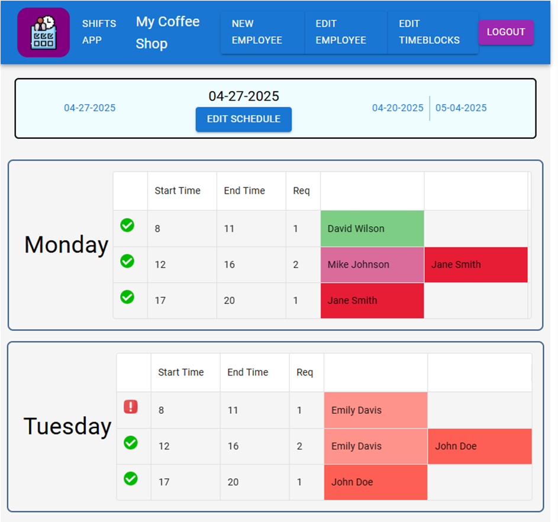
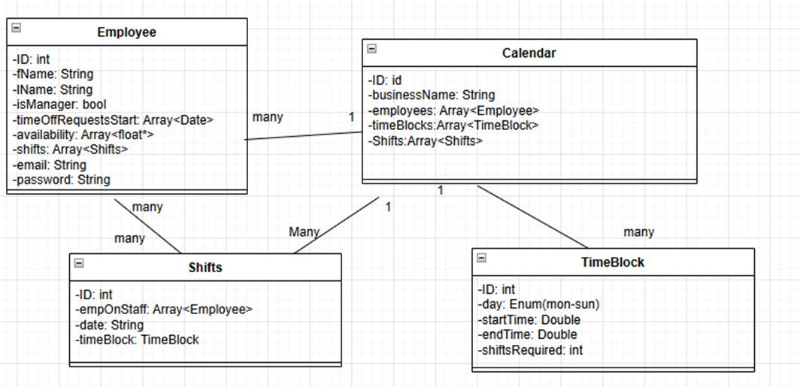
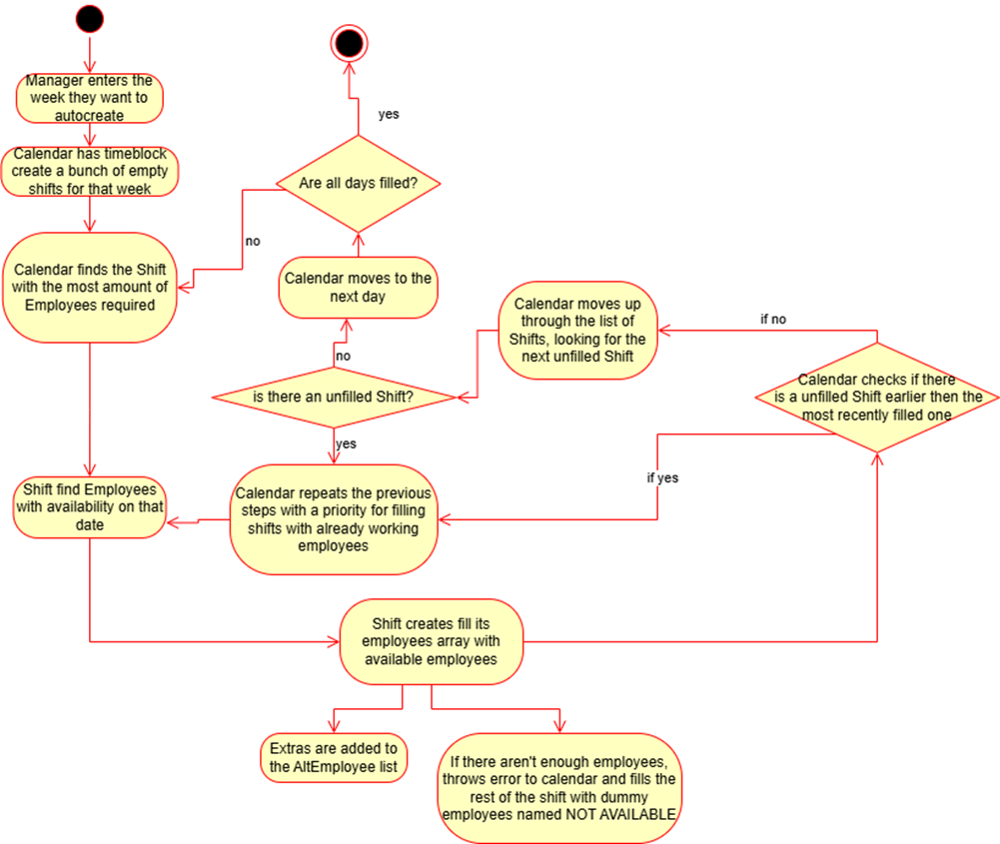
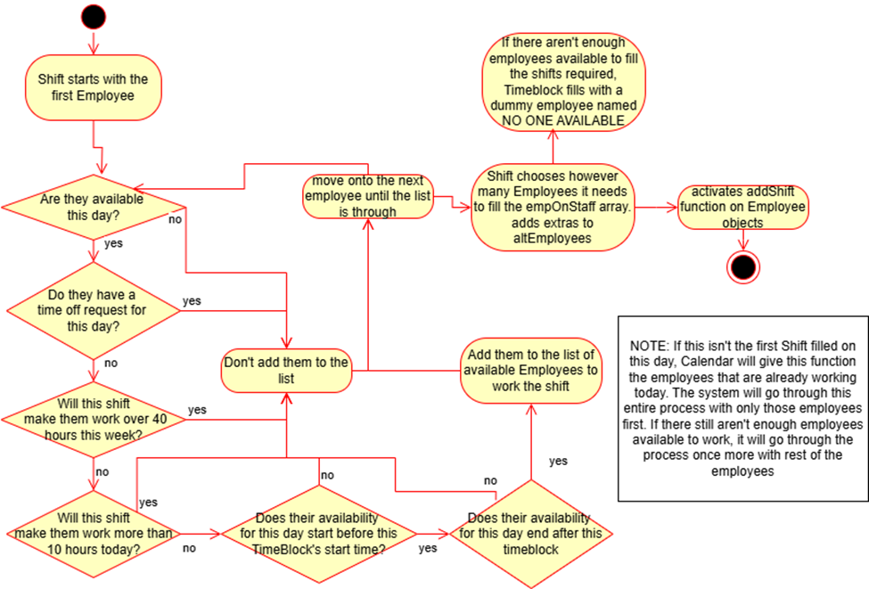
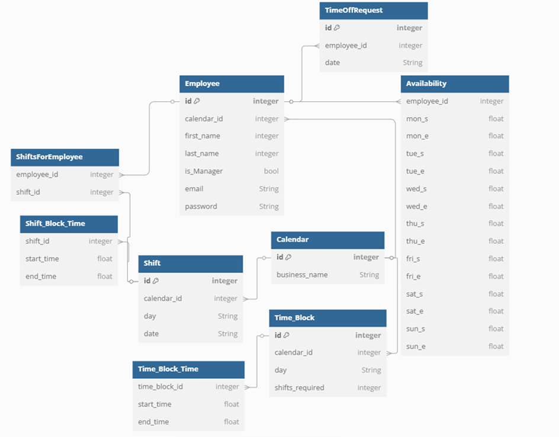

# Shifts App

## Introduction
Scheduling shifts can get complicated for managers within the service industry. Abiding everyone’s time off requests and availability can get overly complicated. At many of my jobs, we used either a proprietary scheduling application created within the company or just an overly complicated excel spreadsheet. Scheduling can take the entire workday if a manager is not using the proper tool. Sometimes a solution that allows everyone their requested time off is hard to see. Often, a mistake could be made that causes people to have to work outside of their availability


## Overview
The main function of this project is to create weekly schedules. A manager will design timeblocks with time ranges and required amounts of employees. They will then be able assign employees to work shifts based off of those time blocks. Each week, a manager will have the option to allow the program to automatically fill a majority of the shifts with employees based off of their availability

This project will be divided between a client and a server. The front end will be used solely for interacting with and displaying processes done on the back end. This application will also be connected to a H2 database.

## Installation
To run this application, you will need to have Java 17,  Maven, Node, and NPM installed on your computer.
``` git clone https://github.com/VBamalie/shifts.git ```
once inside the project directory, you will need to run the following commands:
``` cd backend ```
``` mvn clean install ```
``` mvn spring-boot:run ```
``` cd ../frontend ```
``` npm install ```
``` npm start ```
## Back End
I will be using Java Springboot for the server-side. I have used Maven for all dependencies for the server-side. I will use a Model View Controller design to structure my code. I also have a service folder with more complex business logic
### Tools Used:
* Starter data JPA- This is used to access the H2 database and convert entities into objects
* H2 Database- This is a prototype in memory database 
* Lombok- Anotation library to simplify class construction
* Starter Security- Authentication for client trying to access back end
## Front End
The client-side is typescript React. It displays and interacts with the information that was processed within the server side. The front end sends fetch requests to the back end and receive JSON objects as payloads. I will be using Node for any dependencies needed within React. 
### Tools Used:
* MUI Libraries- graphical components and data grids
* Axios- HTTP client requests
* DayJs- localizes time and dates
* Auth0 React- Client Side Authentication

## Model for Java Classes


## Explanation of more complex business logic
### Shift: 
fillEmpOnStaffAndAltEmployees- checks the availability of each employee and fills the EmpOnStaff array with the required number of employees required. This method then has each employee object within the EmpOnStaff list use the addShift service method to add this shift to their own list of shifts. This method will be overloaded so that a calendar can create a priority for specific employees to be considered for this shift. 
### Employee:
**hoursWorkedThisWeek:** checks through the shifts array for all shifts with this specific date and adds it to a in scope variable called hours worked, returns hours worked variable. The goal is for calendar to make sure that an employee is not working more than 40 hours
**hoursWorkedToday:** checks through the shifts array for all shifts with this specific date and a specific day and adds it to a in scope variable called hours worked, returns hours worked variable. The goal is for shifts to not schedule more than 10 hours.
### EmployeeService:
**AddShift:** once the shift has decided this employee should work that specific shift. The employee object adds that shift to the shift array. A manager can also add a shift to an employee manually.
**RemoveShift:** this method will most likely only be used by a manager manually changing an employee’s shift
## Auto Create
High level view of Autopopulate Functions 

Zoomed in view of populating a Shift with employees 


## Entity Relationship Diagram


## Conclusion
This project taught me a lot. Before, I had mostly created smaller CRUD applications without any complex relationships between objects of data. Creating classes that directly and indirectly affected each other taught me a lot about data architecture, a field I previously felt weak in. I also think I grew stronger in deciphering documentation. Web development requires a lot of tools and libraries that other people created in order to work. I had to parse through a lot of documentation in order to design my code in a way that allowed me to use those tools. Overall, I am happy with how this project turned out. I couldn’t get all the functionality or graphics that I originally wanted, but the final product works and is easy to understand and interact with.
